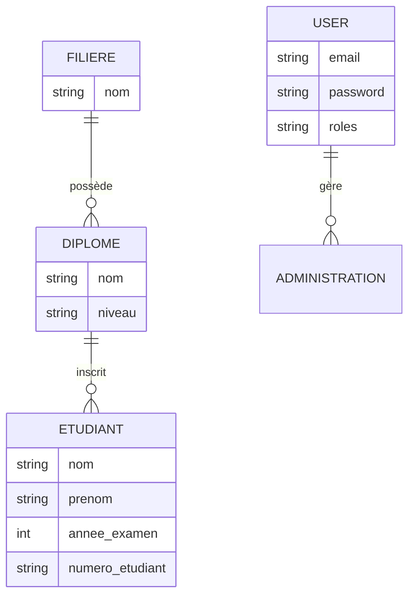

---

# 🎓 Plateforme de Gestion des Résultats d'Examens - Phase 1

## 📌 Présentation du projet

Ce projet consiste en une plateforme de gestion et de publication des résultats d'examens pour une école supérieure. Cette **Phase 1** se concentre sur l'établissement d'une fondation technique solide (le "Noyau Fonctionnel"), incluant la modélisation des données et la sécurisation de l'interface d'administration.

## 🛠 Stack Technique (Choix technologiques)

Conformément aux encouragements technologiques du sujet, les outils suivants ont été utilisés :

* **Back-End :** **Symfony 7.0** (PHP 8.0.3). Utilisation d'un framework professionnel pour structurer l'API et la logique métier.
* **Base de données :** **SQLite**. Base relationnelle obligatoire pour garantir l'intégrité des données via Doctrine ORM.
* **Sécurité :** Symfony Security Bundle avec hachage **BCrypt** et protection **CSRF** activée.
* **Front-End :** **Twig** pour le rendu serveur, configuré pour intégrer **Vue.js** en Phase 2.

## 📊 Modélisation des données (Livrable 1.a)

Le modèle Entité-Relation respecte la hiérarchie structurelle demandée :

* **Filière** : Entité parente regroupant les domaines d'études.
* **Diplôme** : Lié à une filière spécifique.
* **Étudiant** : Lié à un diplôme et à une année d'examen.
* **User** : Gère l'accès sécurisé à l'administration.



## 🚀 Installation et Configuration

1. **Installation des dépendances :**
```bash
composer install

```


2. **Initialisation de la base de données (Schéma) :**
```bash
php bin/console doctrine:migrations:migrate --no-interaction

```


3. **Création de l'administrateur (Preuve de stockage BdD) :**
```bash
php -r "require 'vendor/autoload.php'; (new Symfony\Component\Dotenv\Dotenv())->bootEnv('.env'); \$kernel = new App\Kernel('dev', true); \$kernel->boot(); \$em = \$kernel->getContainer()->get('doctrine.orm.entity_manager'); \$u = new App\Entity\User(); \$u->setEmail('admin@test.com'); \$u->setRoles(['ROLE_ADMIN']); \$u->setPassword(password_hash('admin123', PASSWORD_BCRYPT)); \$em->persist(\$u); \$em->flush(); echo 'ADMIN CRÉÉ : admin@test.com / admin123';"

```


## 🌐 Lancement et Test

1. **Lancer le serveur local :**
```bash
symfony serve

```


*(Ou `php -S 127.0.0.1:8000 -t public`)*

2. **Accès à l'interface :**
Rendez-vous sur [http://127.0.0.1:8000/login](http://127.0.0.1:8000/login).

3. **Identifiants de test :**
* **Email :** `admin@test.com`
* **Mot de passe :** `admin123`


## ✅ État des Livrables - Phase 1

* **Modélisation :** Schéma ER finalisé et base SQLite en place.
* **Back-End :** Environnement Symfony configuré et API CRUD amorcée.
* **Sécurité :** Système d'authentification fonctionnel avec gestion des sessions.
* **Documentation :** Ce fichier README fait office de guide technique et de plan d'architecture.

---
# 🎓 Plateforme Résultats d'Examens

Architecture découplée **Symfony 8 (API REST) + Vue.js 3 (SPA)** avec MySQL via XAMPP.

---

## 📁 Structure du projet

```
projet/
├── back/    → API Symfony 8
└── front/   → Interface Vue.js 3 (Vite)
```

---

## ✅ Prérequis

| Outil   | Version minimale |
|---------|-----------------|
| PHP     | 8.4+            |
| Composer| 2.x             |
| Node.js | 20+             |
| XAMPP   | Dernière version |

---

## 🚀 Installation complète

### Étape 1 — Démarrer XAMPP
Lance XAMPP et démarre **Apache** + **MySQL**.

### Étape 2 — Créer la base de données
1. Ouvre http://localhost/phpmyadmin
2. Clique sur **Nouvelle base de données**
3. Nom : `exam_results` — Encodage : `utf8mb4_general_ci`
4. Clique sur **Créer**

---

### Back-end (Symfony)

```bash
cd back

# 1. Installer les dépendances PHP
composer install

# 2. Installer le bundle CORS
composer require nelmio/cors-bundle

# 3. Copier les variables d'environnement locales
cp .env.local.example .env.local

# 4. Créer les tables
php bin/console doctrine:migrations:migrate --no-interaction

# 5. Créer le premier admin
php bin/console app:create-admin

# 6. Lancer le serveur
symfony serve
```

**API → http://localhost:8000**

---

### Front-end (Vue.js)

```bash
cd front
npm install
npm run dev
```

**App → http://localhost:5173**

---

## 🗂 Routes API principales

### Auth
```
POST /api/auth/login     { "email": "...", "password": "..." }
POST /api/auth/logout
GET  /api/auth/me
```

### Admin (connecté)
```
GET|POST        /api/filieres
GET|PUT|DELETE  /api/filieres/{id}
GET|POST        /api/diplomes
GET|PUT|DELETE  /api/diplomes/{id}
GET|POST        /api/sessions
GET|PUT|DELETE  /api/sessions/{id}
POST            /api/sessions/{id}/valider   ← calcule taux + statut Validé
POST            /api/sessions/{id}/publier   ← statut Publié (visible public)
GET|POST        /api/etudiants
GET|PUT|DELETE  /api/etudiants/{id}
```

### Public (sans connexion)
```
GET /api/public/filieres
GET /api/public/filieres/{id}/diplomes
GET /api/public/sessions/{id}/resultat?email=...
GET /api/public/statistiques?annee=2025
```

---

## 📋 Workflow publication

```
BROUILLON → Inscrire étudiants et noter
     ↓ (Valider)
VALIDÉ    → Taux calculé automatiquement
     ↓ (Publier)
PUBLIÉ    → Visible publiquement + partage social simulé
```

---

## 🖥 Pages de l'application

| URL                 | Accès  | Description                     |
|---------------------|--------|---------------------------------|
| /                   | Public | Accueil                         |
| /resultats          | Public | Consulter son résultat           |
| /statistiques       | Public | Taux de réussite                |
| /login              | Public | Connexion admin                 |
| /admin              | Admin  | Tableau de bord                 |
| /admin/filieres     | Admin  | Gérer les filières              |
| /admin/diplomes     | Admin  | Gérer les diplômes              |
| /admin/sessions     | Admin  | Valider et publier              |
| /admin/etudiants    | Admin  | Inscrire et noter               |

---

## 🛠 Commandes utiles

```bash
# Vérifier les routes API
php bin/console debug:router | grep api

# Créer un admin
php bin/console app:create-admin

# Vider le cache
php bin/console cache:clear

# Nouvelle migration après modif entité
php bin/console make:migration
php bin/console doctrine:migrations:migrate
```
